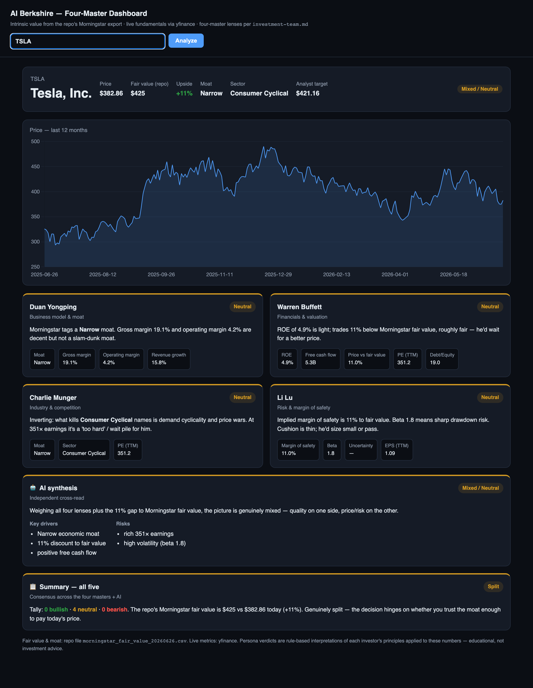
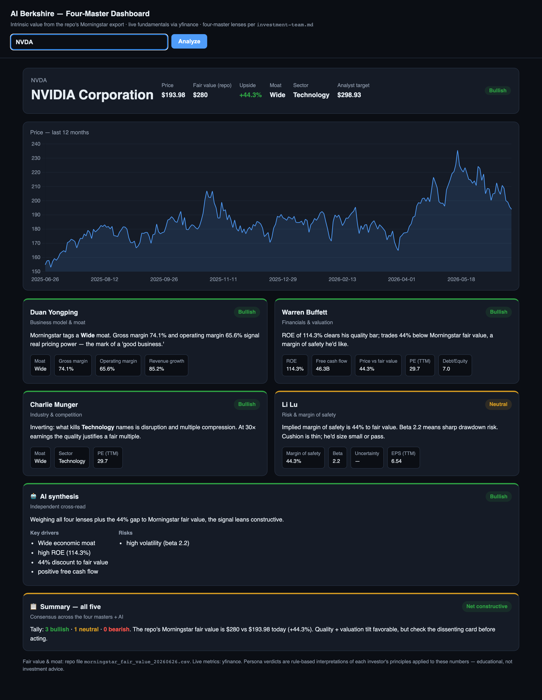

# AI Berkshire — Web UI (community addition)

A small, optional **browser front-end** for [ai-berkshire](https://github.com/xbtlin/ai-berkshire)
by **[@xbtlin](https://github.com/xbtlin)**. It does **not** modify any of the original
tools — it imports them and renders their output in the browser, and adds a thin live-data
layer so you can drive them by ticker.

Everything here is additive. The original CLI tools and Claude Code skills are unchanged.

**TSLA — mixed signal:**


**NVDA — bullish signal:**


## What this fork adds vs. the original

| | Original | This fork |
|---|---|---|
| Interface | CLI tools + Claude Code skill prompts | **+ two web apps** (the original has no UI) |
| Drive by ticker | manual entry / China-focused scrapers | **+ live ticker layer** (any listed stock, via yfinance) |
| Output language | Chinese | **+ English** rendering of the tool output |
| Ticker entry | exact symbol only | **+ name → ticker autocomplete** |
| Four masters | exist as prompts (Claude runs them) | **+ visual card dashboard** with price charts |

## What it adds

| File | Port | What it is |
|------|------|------------|
| `financial_tool.py` | 5055 | Runs the repo's **real** `tools/financial_rigor.py` functions from a web form (market-cap / valuation / cross-validate / Benford / calculator / three-scenario). Output is the tool's own stdout, translated to English. |
| `four_master_dashboard.py` | 5056 | A card dashboard: a price chart + the four-master lenses from `skills/investment-team.md` (Duan Yongping / Buffett / Munger / Li Lu), an AI synthesis card, and a summary card. Intrinsic value is read from the repo's `data/morningstar_fair_value_*.csv`; live metrics via yfinance. |

## Run

```bash
pip install -r web/requirements.txt
python web/four_master_dashboard.py   # http://localhost:5056
python web/financial_tool.py          # http://localhost:5055
```

No API keys, accounts, or secrets are required or used.

## ⚠️ Important disclaimer — read this

- **The four-master cards are a heuristic rule engine.** They apply each investor's
  *documented principles* to live numbers. They are **not** the investors' actual opinions
  and **not** a live LLM analysis. They are educational scaffolding, not a model of what
  Buffett/Munger/Duan/Li Lu would really say.
- **Not investment advice.** Nothing here is a recommendation to buy or sell anything.
- **"Fair value" is Morningstar's published estimate**, fetched by the repo's
  `tools/morningstar_fair_value.py` into a CSV snapshot — the dashboard only displays it.
  It is dated and can be stale.
- **Live fundamentals come from `yfinance`**, an unofficial Yahoo Finance scraper that can
  break or rate-limit without notice. Treat numbers as indicative, verify against filings.
- This UI makes **no claim about trading performance** of any kind.

## Credit & license

Original project © 2026 **xbtlin**, MIT licensed. This addition is offered back under the
same MIT license. See the repository `LICENSE`.
